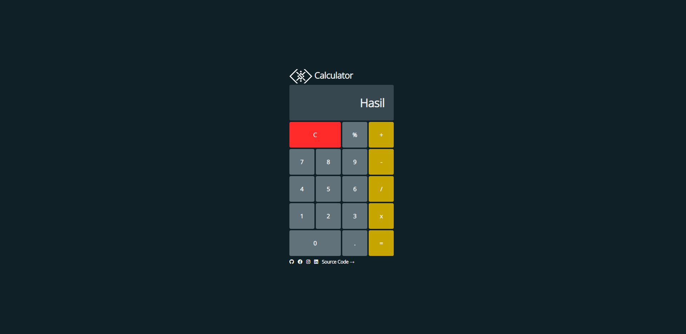

Basic Calculator
===
This repository contains an HTML - Basic Calculator file that I created for an assignment during training by Progate in collaboration with DTS FGA - Front End Developer (HTML, CSS, JavaScript) from Digitalent Kominfo (Ministry of Communication and Informatics) Republic of Indonesia.

## Papar Information
- Title:  `Calculator`
- Author:  [`Manuel Setyo Saputro Sriwibowo`](https://github.com/msetyo15)
- Types: `Basic`, `HTML`, `CSS`, `JavaScript`, `Calculator`
- Files: [view](https://github.com/msetyo15/Basic-Calculator)
- Demo Program: [view](https://msetyo15.github.io/Basic-Calculator/)

## Preview


## Install & Dependence
- text editor (vscode, atom, etc)
- browser (chrome, mozila, edge, etc)

## Dataset Preparation
| Dataset | Download |
| ---     | ---   |
| Icons | [download](https://fontawesome.com/v6/search) |
| Font Open Sans | [download](https://fonts.google.com/specimen/Open+Sans) |


## Directory Hierarchy
```
|—— .gitattributes
|—— assets
|    |—— css
|        |—— main.css
|    |—— img
|        |—— apple-touch-icon.png
|        |—— favicon.png
|        |—— logo.png
|        |—— preview.png
|    |—— js
|        |—— script.js
|—— index.html
|—— README.md
```
## Code Details
### Tested Platform
- software
  ```
  OS: Microsoft Windows 10 Pro (Build 19044)
  vscode: 1.70.1
  chrome: 104.0.5112.81 (64-bit)
  ```
- hardware
  ```
  CPU: AMD Ryzen 3 2200G
  GPU: Radeon Vega Graphics
  ```
